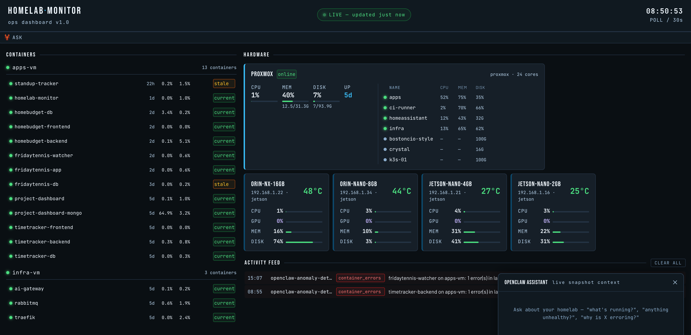

# Using OpenClaw to Build an AI-Powered Homelab Operations Dashboard

## An OpenClaw learning project that produced something genuinely useful

---

I run a homelab with a Proxmox hypervisor, a handful of VMs, four Jetson devices doing local AI inference, and a dozen Docker containers running personal projects. For a while now I've wanted a single dashboard that shows me the health of all of it in one place. Grafana was the obvious choice, but when OpenClaw started getting attention I saw a better opportunity — build the dashboard and learn a new platform at the same time.

The result is homelab-monitor: a Node.js/Express backend, Vue 3 frontend, and a set of OpenClaw skills that collect metrics from every component every 60 seconds. It also has an embedded chat panel that can SSH into any machine in the lab to investigate problems on demand. I built it using Claude with the Sonnet 4.6 model.

---

## The Stack

Before getting into the build, here's what I was working with:

**Infrastructure:**
- Proxmox hypervisor (24-core, 32GB RAM)
- Infra VM: run RabbitMQ, AI Gateway (a REST API for submitting LLM requests), Traefik and now OpenClaw
- Apps VM: runs a series of personal applications implemented with a combination of Node.js, Python, MySQL, Postgres and Mongo.  And now the new monitor
- CI runner VM: GitHub Actions self-hosted runner deploying to the Apps VM
- Four Jetson devices: Orin NX 16GB, Orin Nano 8GB, Nano 4GB, Nano 2GB — running local Ollama models for various workloads
- There are a few other current and in development components but I'll ignore these since they haven't made it into the dashboard yet.

**New additions:**
- **OpenClaw** — a self-hosted AI agent platform with a skills system, cron scheduler, SSH exec tools, and an HTTP gateway
- **homelab-monitor** — what we're building: a Node.js/Express/SQLite backend, Vue 3 frontend, and a set of OpenClaw skills

---

## The Architecture

The core idea is simple: OpenClaw runs scheduled skills on the infra VM, collects metrics from everywhere, and POSTs a unified snapshot to the backend every 60 seconds. The Vue frontend polls and displays it.  The architecture is clean and easily extendable to monitor other components (i.e. Home Assistant)

```
OpenClaw (infra VM)
└── cron: every 60s → homelab-snapshot skill
    ├── docker-stats skill      (SSH → apps VM; local on infra VM)
    ├── log-scanner skill       (SSH → apps VM; local on infra VM)
    ├── jetson-metrics skill    (SSH → all 4 Jetsons)
    ├── proxmox-metrics skill   (HTTPS → Proxmox API)
    ├── github-last-commit skill (HTTPS → GitHub API)
    └── POST → homelab-monitor backend (apps VM:3010)

homelab-monitor backend (Node.js/Express/SQLite)
├── POST /api/monitor/ingest    ← receives snapshots
├── GET  /api/monitor/snapshot  ← polled by frontend
├── POST /api/monitor/events    ← anomaly events
├── DELETE /api/monitor/events  ← clear activity feed
└── POST /api/monitor/chat      ← proxies to OpenClaw gateway

Vue 3 frontend
└── dashboard: containers, VMs, Jetsons, activity feed, chat panel
```

A key architectural decision was to collect the data using code and shell scripts.  There is no need to burn tokens for straight forward data collection, especially considering that the collector runs every minute. More on this later. Claude is only used in the chat panel.

---

## The Skills

OpenClaw's skill system is a workflow/orchestration framework.  This project utilizes its ability to run scripts on a schedule, with SSH exec and HTTP fetch as first-class tools. Each skill is a directory with a `SKILL.md` file defining the skill and a `scripts/` folder with the actual logic.

### jetson-metrics

All three commands — tegrastats, df, and free — run in a single SSH session delimited by ---, which keeps the connection overhead to one round trip per device.

```javascript
const raw = await ssh(host,
  "timeout 2 tegrastats 2>/dev/null | tail -1; echo '---'; df -h / | tail -1; echo '---'; free -m | grep Mem"
);
const [tegrastatsLine, dfLine, freeLine] = raw.split('---').map(s => s.trim());
```

The trickiest part was temperature parsing across JetPack versions. The older Nano 4GB and 2GB devices report temperature as CPU@52C, while the Orin devices use tj@48.5C or SOC2@47C. The parser tries each format in order until one matches:
```javascript
const tempPatterns = [
  /CPU@([\d.]+)C/,      // Nano 4GB/2GB
  /SOC2@([\d.]+)C/,     // Orin variants
  /tj@([\d.]+)C/,       // Orin NX
  /Tboard@([\d.]+)C/,   // fallback
  /thermal@([\d.]+)C/,  // last resort
];
```
 The result is CPU%, GPU%, memory usage, temperature, and disk per device.

### proxmox-metrics

Proxmox has a REST API that provides all of the information we need.  The initial implementation collected data on the Proxmox system. Once this was working the skill was extended to include detailed per-VM statistics.  

```javascript
// Fetch node-level stats from Proxmox API
const nodes = await fetchJson('/nodes');

// Fetch per-VM data for each node
const vms = await fetchJson(`/nodes/${nodeName}/qemu`);

// SSH into each running VM for actual filesystem usage
// (Proxmox only gives allocated disk size, not actual usage)
const disk = await Promise.all(
  vms.map(vm => vm.status === 'running' ? getDiskUsage(vm.name) : null)
);
```

### docker-stats

This skill runs on two hosts in parallel — the apps VM via SSH and the infra VM locally:

```bash
docker ps -a --format '{{json .}}'               # status, uptime, restart count
docker stats --no-stream --format '{{json .}}'   # CPU%, memory%
```

`docker ps` lists all containers including stopped ones. `docker stats` only returns running containers. The skill merges them by container name, so the snapshot always has a complete picture — running containers with live resource usage, stopped containers with their last known state.

This skill needs to deal with the fact that Docker returns status strings in human-readable form ("Up 2 days", "Up 3 hours", "Exited (0) 2 hours ago"). The skill converts these to `uptimeSeconds` so the frontend can format them consistently and the staleness logic has a number to compare against.

### log-scanner

The log scanner has a unique deployment pattern. Rather than running Docker commands over SSH directly, it SCPs a small bash script to each remote host and executes it there:

```javascript
await execAsync(`scp ... ${SCAN_SH} ${host.user}@${host.ip}:${remoteScript}`);
const { stdout } = await execAsync(
  `ssh ... "bash ${remoteScript} ${LOG_WINDOW}; rm -f ${remoteScript}"`
);
```

The script itself is simple — it loops through every running container and counts error and warning patterns in the last 5 minutes:

```bash
for c in $(docker ps --format '{{.Names}}'); do
  logs=$(docker logs --since "$WINDOW" "$c" 2>&1)
  errors=$(printf '%s' "$logs" | grep -ciE 'error|exception|critical|fatal' || true)
  warns=$(printf '%s' "$logs"  | grep -ciE 'warn|warning' || true)
  printf '{"name":"%s","errorCount":%s,"warnCount":%s}\n' "$c" "${errors:-0}" "${warns:-0}"
done
```

The counts feed two things: the visual badge on each container row in the dashboard (red for errors, amber for warnings), and the anomaly detection logic which fires an activity feed event when any errors or warnings appear in a scan window.

The SCP pattern provides flexibility in creating skills. It's slightly more complex than embedding a command string in an SSH call, but it means the logic stays in a file you can test and version-control independently.  The current implementation SCPs the file on each iteration, and deletes it when it finishes.  I plan on modifying the implementation to only download on the initial iteration to make it more efficient.  Before doing that I have to work through error fallback if the script is missing, how do deal with updated versions of the script, etc.

### github-last-commit

The GitHub skill is the simplest of the five — parallel REST API calls against the GitHub API, one per repo:

```javascript
const REPOS = [
  'mikemcg52/FridayTennis',
  'mikemcg52/standup-tracker',
  'mikemcg52/ai-gateway',
  'mikemcg52/home-budget',
  'mikemcg52/project-dashboard',
  'mikemcg52/timetracker',
];

const results = await Promise.all(REPOS.map(fetchRepo));
```

The snapshot orchestrator maps repo names to container name patterns, so each container gets annotated with `lastCommitAt`, `lastCommitSha`, and `lastCommitMessage` from its corresponding repo. The frontend uses `lastCommitAt` vs `uptimeSeconds` to compute the staleness indicator — if a container has been running continuously since before the last commit, the deployment is potentially out of date. It's a simple heuristic but it catches the common homelab failure mode where a fix is pushed but isn't deployed.  Most of the applications auto deploy using the ci-runner VM, but that process can fail for various reasons.

### homelab-snapshot (the orchestrator)

This is the core of the system. It runs the other five skills in parallel, merges the results, and then POSTs the assembled snapshot to the backend (this was a tradeoff decision for the initial implementation.  In general I prefer websockets to polling, so this is under consideration as a future enhancement):

```javascript
const [jetsonMetrics, proxmoxMetrics, dockerStats, logScanner, githubCommits] =
  await Promise.all([
    runSkill('jetson-metrics',     'collect.js'),
    runSkill('proxmox-metrics',    'collect.js'),
    runSkill('docker-stats',       'collect.js'),
    runSkill('log-scanner',        'scan.js'),
    runSkill('github-last-commit', 'collect.js'),
  ]);
```

After assembling the snapshot and posting it, the script checks for anomalies — temperature over threshold, high disk utilization, container errors — and posts events to the activity feed. "Cooldown logic" prevents the same anomaly from appearing more than once every five minutes:

```javascript
const THRESHOLDS = {
  containerErrors:   1,   // errors in 5-min scan window
  containerWarns:    1,   // warnings in 5-min scan window
  jetsonTempC:      70,   // degrees Celsius
  proxmoxCpuPct:    80,   // percent
  vmDiskPct:        85,   // VM filesystem usage
};
```

---

## The Cron Situation

I initially used OpenClaw's built-in cron system to run the snapshot skill. OpenClaw set it up and it ran perfectly, except that it was burning through Anthropic API credits.

The reason: OpenClaw's cron jobs run as agent sessions. Each execution spins up a full Claude session to interpret the skill. For a script that just needs to run `node snapshot.js`, that's completely unnecessary.

When I started this up my balance was already low, and so it errored out quickly when it hit zero.  When I refreshed the credit balance and went back into OpenClaw it surprised me with an unprompted recommendation:

> *"The existing job has been running, but there are two problems: 5 consecutive LLM credit failures — the Anthropic credit balance ran out, which killed the job for several hours. The core issue: using an AI agent session to run a shell script is the wrong tool. Every run spins up a full LLM request. I'll remove the existing agentTurn job and set up a proper system cron instead — it'll run directly, cost nothing, and never fail due to API credits."*

The resulting crontab entry:

```bash
* * * * * /bin/bash -c 'cd /home/user/openclaw-skills/homelab-snapshot && \
  set -a && source /home/mikemcg/openclaw-skills/.env && set +a && \
  node scripts/snapshot.js >> /tmp/homelab-snapshot.log 2>&1'
```

This is the right separation: use the agent for decisions, use the OS for scheduling.

---

## The Frontend

The dashboard is Vue 3 with Vite, no UI framework — just CSS variables and raw components. This screenshot shows it in production:



Layout: narrow left column (containers), wide right column (hardware + activity feed).

The container list shows each running container with uptime, CPU%, memory%, error count, and a staleness indicator (described earlier). 

The hardware section shows the Proxmox hypervisor metrics alongside the VM list — CPU, memory, and disk usage percent for each VM (except for homeassistant - another enhancement is to use the homeassistant API to pull that info since it is not available via SSH). Below that is a grid with the four Jetsons showing GPU%, temperature, and memory.  There are a couple of other hardware components to add here in the future.

The activity feed at the bottom shows agent events with type-coded badges. Red for errors, amber for warnings and infrastructure alerts. Events can be dismissed individually or the entire block can be dismissed using the clear-all button.

---

## The Chat Panel

The final piece of the puzzle is the embedded OpenClaw chat panel. It is opened using the "Ask" icon in the upper left of the screen, and opens in a slide-up panel in the lower right corner of the dashboard. 

The backend routes each message through the OpenClaw gateway, injecting the current snapshot as system context, along with tool exec information:

```javascript
const systemPrompt = `You are a homelab assistant with access to live 
infrastructure data and the ability to run commands on homelab machines.

SSH ACCESS: You have SSH access to the following hosts using key 
~/.ssh/openclaw_collector:
- apps VM:    mikemcg@...
- infra VM:   mikemcg@...
- ci-runner:  mikemcg@...
- Orin NX:    jetson@...
[...]

Current snapshot collected at ${snapshot.collectedAt}:
${JSON.stringify(snapshot.payload, null, 2)}`;
```

Because OpenClaw has exec tools and the system prompt tells it which machines it can SSH into, it can investigate problems rather than just talking about them. Here is an example showing error entries in the Activity Feed.  First I ask it about one of the errors:


OpenClaw SSH's into the apps VM, pulls recent container logs and diagnoses and reports the current situation.  In this case the error is stale, and the application has recovered and is operating normally.


### The Timeout Problem

The initial chat implementation used a simple request/response pattern with a 60-second timeout. This worked for simple questions but failed for anything involving actual investigation — SSH operations, log analysis, `docker system df`. The response came back as an HTML error page because the connection timed out.

The fix for this was to implement Server-Sent Events (SSE) streaming. The backend opens an SSE stream to the frontend and a streaming connection to the OpenClaw gateway simultaneously. Chunks arrive as they're generated. A heartbeat comment (`\`: heartbeat\``) is sent every 15 seconds to keep the connection alive through proxies:

```javascript
// Backend: set up SSE and stream from gateway
res.setHeader('Content-Type', 'text/event-stream');
res.setHeader('Cache-Control', 'no-cache');
const heartbeat = setInterval(() => res.write(': heartbeat'), 15000);

// Stream gateway chunks to client
for await (const chunk of response.body) {
  // parse SSE chunks and forward as 'chunk' events
}
```

```javascript
// Frontend: read the stream incrementally
const reader = res.body.getReader();
while (true) {
  const { done, value } = await reader.read();
  // append delta to the assistant message in real time
}
```

The timeout is now 5 minutes, and the response streams in word-by-word, providing a much improved user experience. And, equally importantly, long running operations like "clean up Docker images on ci-runner" work properly.

---

## What the Dashboard Caught

Within the first hour of running the full system:

**The ci-runner disk situation.** The VM was at 98% disk (`26.4GB / 28.4GB`). The anomaly detector posted a `high_disk` event to the activity feed. I asked the chat panel to investigate, and it responded with the exact breakdown: 8.4GB in Docker build cache, 12.8GB in stale images from CI iterations. Then it offered to clean this up — which it did via SSE streaming, and also offered to implement a shell script and cron job on ci-runner to prevent it from occurring in the future.  Next time ci-runner disk usage generates an alert I will let it do that.

**homebudget-db errors.** This container was generating a stream of errors which were undetected since they did not affect application functionality.     The dashboard immediately showed the elevated error counts for that container.  A request in the chat panel identified the issue as a failing `pg_isready` health check that was missing a required flag.  

It is satisfying when a project like this is so immediately useful.

---

## CI/CD

The deployment follows the same pattern as my other homelab projects: GitHub Actions on a self-hosted runner, building the necessary Docker image(s), pushing to GHCR, and deploying to the apps VM via SSH.

Traefik on the infra VM routes `monitor.homelab.local` to the apps VM on port 3010, with the DNS rewrite handled by AdGuard. The dashboard is now available at a proper URL on any device on my local or tailscale network.

---

## What I Learned

The best agent architecture is the one that doesn't use the agent. The cron story drove this home. OpenClaw's value isn't in running scripts on a timer — cron does that for free. Its value is in the exec tools and the chat interface, where an LLM can actually reason about a problem. The final architecture reflects this: deterministic code for collection, the agent for investigation and action. Knowing where that boundary sits is the real lesson.

OpenClaw's skill structure is a natural fit for this kind of system. Each skill is a self-contained directory with its own scripts, independently testable outside of OpenClaw. That made development fast — I could iterate on jetson-metrics from the command line without running the full orchestrator. It's a well-organized framework, and the resulting architecture is clean enough that the skills could be pulled out and run with plain cron if I ever moved away from OpenClaw.

Exec access is what makes the chat panel more than a novelty. Without SSH, the chat panel would just be a natural language wrapper around the snapshot data — interesting for about five minutes. With it, the agent diagnosed a failing health check, identified 20GB of build cache on ci-runner, and offered to clean it up. The gap between "tell me about a problem" and "fix the problem" is the difference between a demo and a tool.

This project only scratched the surface of what OpenClaw can do. The skills here are simple scripts running in parallel — there's no agent-to-agent coordination, no dynamic skill selection, no feedback loops. I have ideas for a multi-agent project that would push into that territory, and if I build it I'll write it up.

---

## What's Next

The dashboard itself has gaps to fill: Home Assistant metrics (the VM doesn't allow SSH, so I'll need to use its REST API), the remaining Jetson workload details, and a move from polling to WebSockets for the frontend. The staleness indicator is a useful heuristic but I'd like to add proper deployment tracking tied to the CI pipeline rather than inferring it from commit timestamps.

On the OpenClaw side, security is the elephant in the room. This system has SSH access to every machine in my lab, gated only by the fact that it's running on an isolated home network. That's fine for a homelab — it's a different conversation for anything beyond one. I haven't dug into OpenClaw's access control model yet, but that's the next thing I'd want to understand before recommending this pattern to anyone else.

---

## The Code

The full project is on GitHub at `mikemcg52/homelab-monitor-public`. The openclaw-skills directory contains all five collection skills as standalone Node.js scripts — they can be run independently without OpenClaw for development and testing.  Please feel free to adapt it to your own environment.

---

*Mike McGonagle is a software developer and consultant with enough years of professional software development experience that he'd rather not say.  He works with teams adopting AI-assisted development and runs a homelab for AI/ML experimentation (and because it's fun).*
